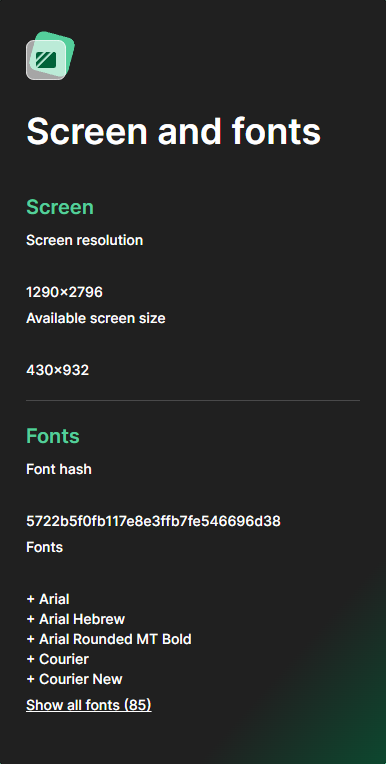

# iOS Device Spoofing for Web Scraping

This project provides a spoofing layer that emulates an iPhone 14 Pro Max at both the network (TCP/IP) and browser fingerprint levels in a way that is highly realistic.
Its purpose is to help bypass advanced bot detection systems during web scraping operations.

⚠️ Note: This tool does not perform scraping itself; instead, it offers a stealth infrastructure to be used alongside your scraping setup.
By mimicking the behaviors of a real mobile device (e.g., TTL, TCP window size, browser fingerprinting, WebRTC, canvas behavior, etc.), it allows browser automation tools (like Playwright or Selenium) to operate in a much less detectable manner.

With this layer, your scraping activities become significantly less likely to be flagged as bot traffic, letting you interact with target websites as if you're browsing from a real iPhone, enabling safer and more uninterrupted data extraction.

🧪 **Tested Bot Detection Sites:**

<strong>- deviceandbrowserinfo.com/are_you_a_bot (Perfectly matches a real device)</strong>

<strong>- pixelscan.net (Bot-Detection) (Partially bypassed)</strong>

<strong>- pixelscan.net (Screen and fonts)</strong>

<strong>- pixelscan.net (Hardware fingerprints)</strong>

<strong>- pixelscan.net (Detected Operating System)</strong>

<strong>- iproyal.com/tcp-ip-fingerprint-checker (Scores similar to a real device)</strong>

<strong>- demo.fingerprint.com/playground</strong>

<strong>- bot.sannysoft.com (Same information as a real device)</strong>

<strong>- browserleaks.com/javascript (Same information as a real device)</strong>

<strong>- browserleaks.com/fonts (Same information as a real device)</strong>

<strong>- browserleaks.com/tls (Same information as a real device)</strong>

<strong>- browserleaks.com/webrtc (Same information as a real device)</strong>

**📚 Used Libraries:**
- Patchright: Undetected version of Playwright (browser automation and fingerprint spoofing).
- Pydivert: To capture and manipulate network traffic.
- Scapy: To craft custom network packets.

**⚙️ Installation & Usage**
- Run ipconfig to find your IPv4 address and paste it into the insert_your_ipv4_address section in tcp.py.
- Run arp -a to get your gateway MAC address and paste it into the insert_your_gateway_mac section in tcp.py (e.g., 00:11:22:33:44:55).
- Open CMD as Administrator, navigate to the project directory using cd your_folder_path, and run it with python tcp.py.

Beni desteklemek için projeyi yıldızlarsanız çok sevinirim. Teşekkürler.

I would greatly appreciate it if you could star the project to support me. Thank you!.

